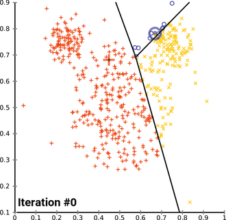

## K Mean Clustering
We have use the **Iris Dataset**  from [UCI Machine Learning, Kaggle](https://www.kaggle.com/uciml/iris) which can be easily loaded using:
```python
from sklearn import datasets
iris = datasets.load_iris()
```
That's it the dataset is loaded.

Lets have a brief look about **K Mean Clustering**:

- K Means Clustering is a machine learning algorithm used to partition or cluster data points by calculating squared Euclidean distance between the points and cluster centers.
- Firstly the cluster centers are initialized random and later the distance is calculated and the centers moves based on the distance from the data points.
- This can be observed in the animation from wikipedia below:



**The big question is how to determine the optimal number of cluster :**
### Elbow Method
The basic intution is to calculate the sum of mean square errors and plot the graph as below:


We can see a certain linearity in the graph from k=3 and so we can assign the n_clusters=3.

### Applications:
- Document Classification 
- Recommendation Engine
