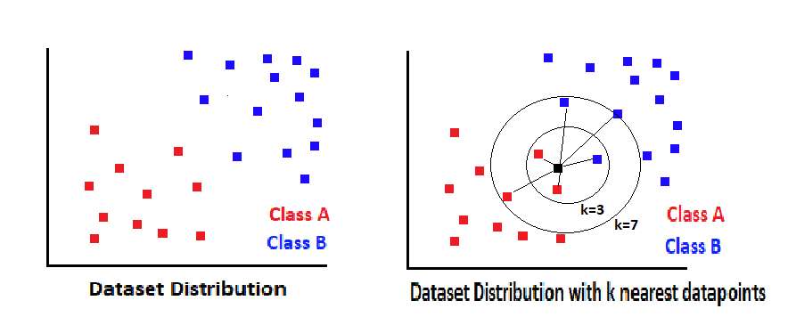

# K-Nearest Neighbors with Scikit-learn in Python

**We use the <a href="https://www.kaggle.com/uciml/red-wine-quality-cortez-et-al-2009">Red Wine Quality</a> Dataset originally contributed by <a href="https://archive.ics.uci.edu/ml/index.php">UCI Machine Learning</a>**

## A brief introduction to K-Nearest Neighbors(KNN):

- K-nearest neighbors (KNN) algorithm is a simple, easy-to-implement supervised machine learning algorithm that can be used to solve both classification and regression problems.

- The following two properties would define KNN well as :

  * Lazy learning algorithm : KNN is a lazy learning algorithm because it does not have a specialized training phase and uses all the data for training while classification.

  * Non-parametric learning algorithm : KNN is also a non-parametric learning algorithm because it doesn’t assume anything about the underlying data.

- K-nearest neighbors (KNN) algorithm uses feature similarity to predict the values of new datapoints based on the distance from the training set.

### Different ways to calculate the distance in KNN:

- Euclidean Method

- Manhattan Method

- Minkowski Method

- Hamming Method

The most commonly used method to calculate distance is Euclidean.

## Concept of K and working of KNN algorithm:

Suppose we have a dataset, And we need to classify new data point with black dot into A or B class.  

We have assumed K = 3.So, it would find three nearest data points. Again we assumed K = 7, then it find seven nearest data points.

## Some Use Cases:

- Finance
- Healthcare
- Politics(VOTE)
- Credit Ratings
- Handwriting Detection
