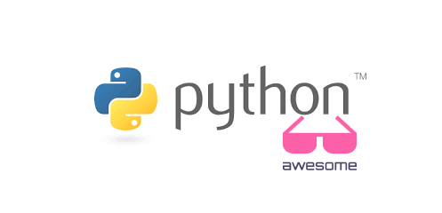

# Python3 by practice




:wave: Welcome to **Python3 by practice**! We are an open source community contributing to compile a collection of learning resources
for **Python** enthusiasts, or anyone who finds these resources useful. If you contributed to this repo in any manner 
navigate to [Contributors](https://github.com/Rishit-dagli/Python3-by-practice#contributors-) to find your name and photo listed there.

Show some :heart: and :star: this repository!

## Wish to contribute to this repository? :sparkles:
Notes, eBooks, or any type of learning resources are welcome for contribution to this repository so that students from across the :earth_asia: could be benefited. I also advise you to take a look at [CODE OF CONDUCT](https://github.com/Rishit-dagli/Python3-by-practice/blob/master/CODE_OF_CONDUCT.md) and [CONTRIBUTING](https://github.com/Rishit-dagli/Python3-by-practice/blob/master/CONTRIBUTING.md). Here are the steps to help you along :scroll:

### 1. Fork this repository :fork_and_knife:
You can get your own fork/copy of [Python3 by practice](https://github.com/Rishit-dagli/Python3-by-practice) by using the <a href="https://github.com/Rishit-dagli/Python3-by-practice/new/master?readme=1#fork-destination-box"><kbd><b>Fork</b></kbd></a> button or clicking [here](https://github.com/Rishit-dagli/Python3-by-practice/new/master?readme=1#fork-destination-box).
 [](https://github.com/CoderJolly/IPU-Engineering-Notes)
 
 
### 2. Clone this repository :busts_in_silhouette:
You need to clone (download a copy of) this repository to your local machine using:
```sh
$ git clone https://github.com/Your_Username/Python3-by-practice.git
```
> This makes a local copy of repository in your machine.
Once you have cloned the `Python3-by-practice` repository in GitHub, move to that folder first using change directory command on linux and Mac.
```sh
# This will change directory to a folder Python3-by-practice
$ cd Python3-by-practice
```
Move to this folder for all other commands.

### 3. Set it up :wrench:
Run the following commands to see that *your local copy* has a reference to *your forked remote repository* in GitHub :octocat:
```sh
$ git remote -v
origin  https://github.com/Your_Username/Python3-by-practice.git (fetch)
origin  https://github.com/Your_Username/Python3-by-practice.git (push)
```
Now, lets add a reference to the original [Python3-by-practice](https://github.com/Rishit-dagli/Python3-by-practice) repository using
```sh
$ git remote add upstream https://github.com/Rishit-dagli/Python3-by-practice.git
```
> This adds a new remote named ***upstream***.
See the changes using
```sh
$ git remote -v
origin    https://github.com/Your_Username/Python3-by-practice.git (fetch)
origin    https://github.com/Your_Username/Python3-by-practice.git (push)
upstream  https://github.com/Rishit-dagli/Python3-by-practice.git (fetch)
upstream  https://github.com/Rishit-dagli/Python3-by-practice.git (push)
```

### 4. Ready, Set, Go!!! :turtle::rabbit2:
Once you have completed these steps, you are ready to start contributing by checking our `Help Wanted` Issues and creating [pull requests](https://github.com/Rishit-dagli/Python3-by-practice.git/pulls).

### 5. Create a new branch :bangbang:
Whenever you are going to make contribution. Please create separate branch using command and keep your `master` branch clean (i.e. synced with remote branch).
```sh
# It will create a new branch with name Branch_Name and switch to branch Folder_Name
$ git checkout -b Folder_Name
```
Create a separate branch for contribution and try to use same name of branch as of folder.
To switch to desired branch
```sh
# To switch from one folder to other
$ git checkout Folder_Name
```
To add the changes to the branch. Use
```sh
# To add all files to branch Folder_Name
$ git add .
```
Type in a message relevant for the code reviewer using
```sh
# This message get associated with all files you have changed
$ git commit -m 'relevant message'
```
### 6. Push your awesome work to your remote repository :rocket:
```sh
# To push your work to your remote repository
$ git push -u origin Folder_Name
```
### 7. Finally, make a PR! :fire:
Go to your repository in browser and click on `compare and pull requests`.
Then add a title and description to your pull request that explains your precious effort.

## Contributors ✨

Thanks goes to these wonderful people ([emoji key](https://allcontributors.org/docs/en/emoji-key)):

<!-- ALL-CONTRIBUTORS-LIST:START - Do not remove or modify this section -->
<!-- prettier-ignore-start -->
<!-- markdownlint-disable -->
<table>
  <tr>
    <td align="center"><a href="https://www.rishit.tech"><br /><sub><b>Rishit Dagli</b></sub></a><br /><a href="https://github.com/Rishit-dagli/Python3-by-practice/commits?author=Rishit-dagli" title="Code">💻</a></td>
    <td align="center"><a href="https://rashiwal.me/"><br /><sub><b>Rohit Ashiwal</b></sub></a><br /><a href="https://github.com/Rishit-dagli/Python3-by-practice/commits?author=r1walz" title="Code">💻</a></td>
    <td align="center"><a href="https://github.com/Aditya-1500"><br /><sub><b>Aditya-1500</b></sub></a><br /><a href="https://github.com/Rishit-dagli/Python3-by-practice/commits?author=Aditya-1500" title="Code">💻</a></td>
    <td align="center"><a href="https://github.com/subhipandey"><br /><sub><b>Subhi Pandey</b></sub></a><br /><a href="#content-subhipandey" title="Content">🖋</a></td>
    <td align="center"><a href="https://www.linkedin.com/in/avinkumar"><br /><sub><b>Avinash Kumar</b></sub></a><br /><a href="#content-Avinashshah099" title="Content">🖋</a> <a href="https://github.com/Rishit-dagli/Python3-by-practice/commits?author=Avinashshah099" title="Code">💻</a></td>
    <td align="center"><a href="https://github.com/kushalbargoti"><br /><sub><b>Kushal Bargoti</b></sub></a><br /><a href="#content-kushalbargoti" title="Content">🖋</a></td>
    <td align="center"><a href="https://github.com/artorias111"><br /><sub><b>Shriram Bhat</b></sub></a><br /><a href="#content-artorias111" title="Content">🖋</a></td>
  </tr>
  <tr>
    <td align="center"><a href="https://www.instagram.com/mr_codeaholic/"><br /><sub><b>Preetam Rane</b></sub></a><br /><a href="#content-Preetam2114" title="Content">🖋</a></td>
    <td align="center"><a href="https://github.com/ChiragSaxena5437"><br /><sub><b>Chirag saxena</b></sub></a><br /><a href="#content-ChiragSaxena5437" title="Content">🖋</a></td>
    <td align="center"><a href="https://github.com/aditya9110"><br /><sub><b>Aditya Mahimkar</b></sub></a><br /><a href="https://github.com/Rishit-dagli/Python3-by-practice/commits?author=aditya9110" title="Code">💻</a></td>
    <td align="center"><a href="https://www.linkedin.com/in/shubham-sah/"><br /><sub><b>Shubham Sah</b></sub></a><br /><a href="https://github.com/Rishit-dagli/Python3-by-practice/commits?author=shubhamsah" title="Code">💻</a></td>
    <td align="center"><a href="https://github.com/manthan89-py"><br /><sub><b>Manthan Bhikadiya</b></sub></a><br /><a href="#content-manthan89-py" title="Content">🖋</a></td>
    <td align="center"><a href="https://github.com/chetak123"><br /><sub><b>Ayushman</b></sub></a><br /><a href="#content-chetak123" title="Content">🖋</a></td>
    <td align="center"><a href="http://jagadyudha.github.io"><br /><sub><b>Jagad yudha</b></sub></a><br /><a href="https://github.com/Rishit-dagli/Python3-by-practice/commits?author=jagadyudha" title="Code">💻</a></td>
  </tr>
  <tr>
    <td align="center"><a href="https://github.com/gpriya32"><br /><sub><b>Priyanka Gupta</b></sub></a><br /><a href="#content-gpriya32" title="Content">🖋</a></td>
    <td align="center"><a href="https://theja-vanka.github.io/"><br /><sub><b>Krishnatheja Vanka</b></sub></a><br /><a href="https://github.com/Rishit-dagli/Python3-by-practice/commits?author=theja-vanka" title="Code">💻</a></td>
    <td align="center"><a href="https://github.com/sujoy-coder"><br /><sub><b>sujoy-coder</b></sub></a><br /><a href="https://github.com/Rishit-dagli/Python3-by-practice/commits?author=sujoy-coder" title="Code">💻</a></td>
    <td align="center"><a href="https://jeremie-gauthier.github.io/"><br /><sub><b>jergauth</b></sub></a><br /><a href="https://github.com/Rishit-dagli/Python3-by-practice/commits?author=jeremie-gauthier" title="Code">💻</a></td>
    <td align="center"><a href="https://github.com/cocobaco"><br /><sub><b>Roppon Picha</b></sub></a><br /><a href="#content-cocobaco" title="Content">🖋</a></td>
    <td align="center"><a href="https://github.com/kmert10"><br /><sub><b>Mert Karakas</b></sub></a><br /><a href="https://github.com/Rishit-dagli/Python3-by-practice/commits?author=kmert10" title="Code">💻</a></td>
    <td align="center"><a href="https://karan-ksrk.github.io/"><br /><sub><b>karan-ksrk</b></sub></a><br /><a href="#content-karan-ksrk" title="Content">🖋</a></td>
  </tr>
  <tr>
    <td align="center"><a href="https://github.com/antonioalmeidab"><br /><sub><b>Antonio Almeida</b></sub></a><br /><a href="https://github.com/Rishit-dagli/Python3-by-practice/commits?author=antonioalmeidab" title="Code">💻</a></td>
    <td align="center"><a href="https://github.com/itsnotsagar"><br /><sub><b>Sagar Yadav</b></sub></a><br /><a href="#content-itsnotsagar" title="Content">🖋</a></td>
    <td align="center"><a href="https://github.com/PRIYANSHU-AMBITION/"><br /><sub><b>PRIYANSHU TRIVEDI</b></sub></a><br /><a href="https://github.com/Rishit-dagli/Python3-by-practice/commits?author=PRIYANSHU-AMBITION" title="Code">💻</a></td>
    <td align="center"><a href="https://github.com/reddymahendra52"><br /><sub><b>reddymahendra52</b></sub></a><br /><a href="https://github.com/Rishit-dagli/Python3-by-practice/commits?author=reddymahendra52" title="Code">💻</a></td>
  </tr>
</table>

<!-- markdownlint-enable -->
<!-- prettier-ignore-end -->
<!-- ALL-CONTRIBUTORS-LIST:END -->

This project follows the [all-contributors](https://github.com/all-contributors/all-contributors) specification. Contributions of any kind welcome!
